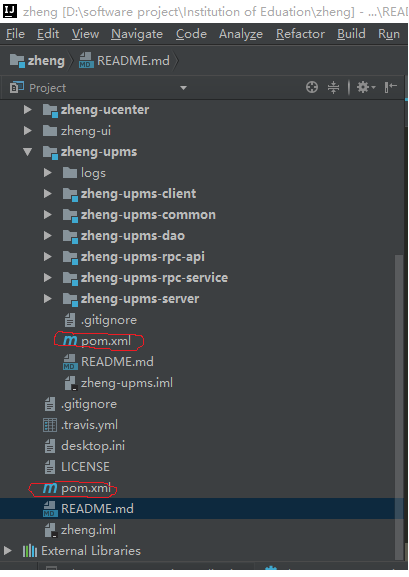
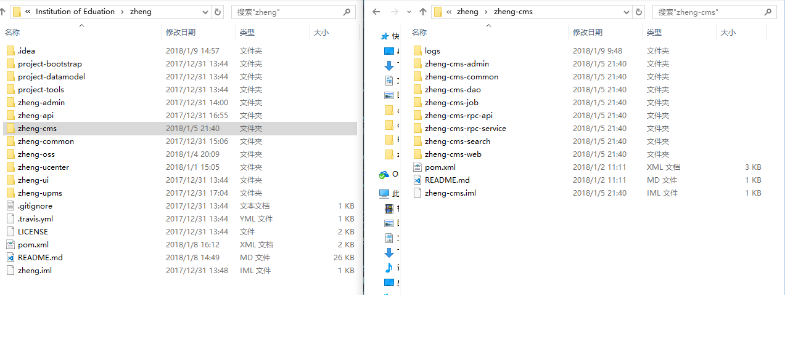

# 开发演示
- [开发演示](#%E5%BC%80%E5%8F%91%E6%BC%94%E7%A4%BA)
    - [项目管理](#%E9%A1%B9%E7%9B%AE%E7%AE%A1%E7%90%86)
    - [框架规范约定](#%E6%A1%86%E6%9E%B6%E8%A7%84%E8%8C%83%E7%BA%A6%E5%AE%9A)
    - [创建数据表](#%E5%88%9B%E5%BB%BA%E6%95%B0%E6%8D%AE%E8%A1%A8)
    - [子系统添加](#%E5%AD%90%E7%B3%BB%E7%BB%9F%E6%B7%BB%E5%8A%A0)
        - [前端](#%E5%89%8D%E7%AB%AF)
        - [后端](#%E5%90%8E%E7%AB%AF)
        - [SSO](#sso)
## 项目管理


最外面的**pom.xml**负责加载工程中所有的子系统，需要添加子系统请修改此文件。
每个子系统中包含多个maven管理的子模块，以upms为例，这个模块中包含6个子模块，由upms子系统的**pom.xml**负责管理。

## 框架规范约定
约定优于配置(convention over configuration)，此框架约定了很多编程规范，下面一一列举：

```

- service类，需要在叫名`service`的包下，并以`Service`结尾，如`CmsArticleServiceImpl`

- controller类，需要在以`controller`结尾的包下，类名以Controller结尾，如`CmsArticleController.java`，并继承`BaseController`

- spring task类，需要在叫名`task`的包下，并以`Task`结尾，如`TestTask.java`

- mapper.xml，需要在名叫`mapper`的包下，并以`Mapper.xml`结尾，如`CmsArticleMapper.xml`

- mapper接口，需要在名叫`mapper`的包下，并以`Mapper`结尾，如`CmsArticleMapper.java`

- model实体类，需要在名叫`model`的包下，命名规则为数据表转驼峰规则，如`CmsArticle.java`

- spring配置文件，命名规则为`applicationContext-*.xml`

- 类名：首字母大写驼峰规则；方法名：首字母小写驼峰规则；常量：全大写；变量：首字母小写驼峰规则，尽量非缩写

- springmvc配置加到对应模块的`springMVC-servlet.xml`文件里

- 配置文件放到`src/main/resources`目录下

- 静态资源文件放到`src/main/webapp/resources`目录下
- jsp文件，需要在`/WEB-INF/jsp`目录下

- `RequestMapping`和返回物理试图路径的url尽量写全路径，如：`@RequestMapping("/manage")`、`return "/manage/index"`

- `RequestMapping`指定method

- 模块命名为`项目`-`子项目`-`业务`，如`zheng-cms-admin`

- 数据表命名为：`子系统`_`表`，如`cms_article`

- 更多规范，参考[[阿里巴巴Java开发手册] http://git.oschina.net/shuzheng/zheng/attach_files

```
## 创建数据表
将设计好的数据表导入数据库中即可
## 子系统添加
子系统添加参照zheng-cms内容管理系统
``` lua
root
├── root-common -- SSM框架公共模块
├── root-admin -- 后台管理模板
├── root-upms -- 用户权限管理系统
|    ├── root-upms-common -- upms系统公共模块
|    ├── root-upms-dao -- 代码生成模块，无需开发
|    ├── root-upms-client -- 集成upms依赖包，提供单点认证、授权、统一会话管理
|    ├── root-upms-rpc-api -- rpc接口包
|    ├── root-upms-rpc-service -- rpc服务提供者
|    └── root-upms-server -- 用户权限系统及SSO服务端[端口:1111]
├── root-mydemo -- 管理系统
     ├── root-mydemo-common -- 系统公共模块
     ├── root-mydemo-dao -- 代码生成模块，无需开发
     ├── root-mydemo-rpc-api -- rpc接口包
     ├── root-mydemo-rpc-service -- rpc服务提供者
     ├── root-mydemo-admin -- 后台管理
     └── root-mydemo-web -- 网站前台


```
> 添加子系统(cms)
- File->Project Structure -> Module -> '+' -> next -> 设置子系统设置parent->zheng,子系统模块设置parent->cms,module 存放的路径需要自己修改，参考cms各个子模块的文件路径格式
- **pom.xml** 也需要根据编译要求进行修改，参考cms
- 

> 系统数据库层(root-mydemo-dao)
- 代码生成模块，无需开发
- 拷贝其它系统得代码生成类，更改包的路径，添加数据库表，直接运行对应项目dao模块中的generator.main()，可自动生成单表的CRUD功能和对应的model、example、mapper、service代码
- 生成的model和example均已实现Serializable接口，支持分布式
- 已包含抽象类BaseServiceImpl，只需要继承抽象类并传入泛型参数，即可默认实现mapper接口所有方法，特殊需求直接扩展即可
- BaseServiceImpl默认已实现四种根据条件分页接口
- BaseServiceImpl方法根据读写操作自动切换主从数据源，继承的扩展接口，可手动通过`DynamicDataSource.setDataSource(DataSourceEnum.XXX.getName())`指定数据源

> 系统公共模块(root-mydemo-common)(非必须)
- 可以放置一些数据结构，util类等

> 系统rpc接口包(root-mydemo-rpc-api)
- 定义服务类接口，需要继承BaseService
- mock 是服务模拟，不用管

> 系统rpc服务提供者(root-mydemo-rpc-service)
- 服务的真正提供方，需要实现rpc-api 和 继承BaseServiceImpl
- 因为服务是通过rpc调用，需要注册rpc服务[http://dubbo.io/](http://dubbo.io/)，将服务类配置到**applicationContext-dubbo-provider.xml**中(配置方法参考cms)，rpc服务的提供方为 **rpc-provider**
> 系统后台管理(root-mydemo-admin)
- 启动此模块，总系统加载后，可以在总系统中加载次模块
- 该模块是一个完整的网页框架，包括前端和后端
- 其他模块实际上为此模块的底层模块，改模块提供前端代码和后端控制类
- rpc服务的消费者**rpc-consumer**配置在这个模块的**applicationContext-dubbo-consumer.xml**

> 网站前台(root-mydemo-web)(非必须)
### 前端
前端涉及到**jstl** 和 **el**, **jstl**的样例: <c: if> <c: foreach>, **el**表达式用于取值,样例 ${basePath}
前端向后端传值在系统中目前看到两种用法
- href = '${basePath}/sso/login' 直接到后台的Controller
- ajax 发送请求，这个是通用用法
### 后端
- 后端采用的框架是SpringMVC
- 一个前端请求根据路径会到达对应的后端Controller模块,/sso/login 会到达SSOController 的 login 函数，路径的对应看的是类和方法上面的@RequestMapping
### SSO
- SSO负责单点登录，代码中已经实现，有兴趣可以去查找相关资料，实现单点登录的模块为zheng-upms-client
- 在子系统中实现单点登录，需要在pom.xml 添加zheng-upms-client模块， web.xml 需要添加 shiroFilter 过滤
- 对于配置了shiroFilter的项目，登录时会被拦截，页面会导入到单点登录的页面，已经实现不用写这块的代码，只需参照样例(cms)写好配置文件


